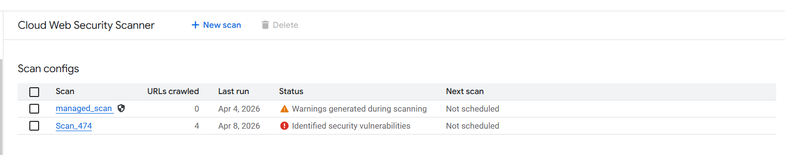
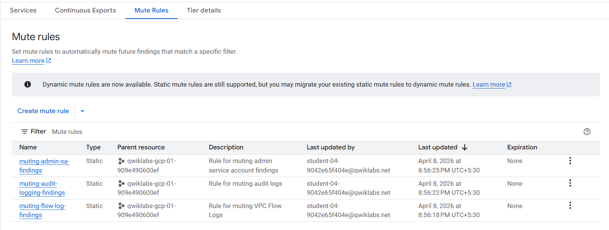

# 🔐 GCP Threat Mitigation using Security Command Center (SCC)

This project demonstrates how to identify, analyze, and mitigate security threats in a Google Cloud environment using **Security Command Center (SCC)**, **Web Security Scanner**, and **Cloud Storage**.

---

## 📌 Objective

Simulate a real-world cloud security scenario and perform:

- Detection of vulnerabilities and misconfigurations  
- Analysis of security findings  
- Threat mitigation using firewall and IAM controls  
- Exporting findings for further analysis  

---

## 🏗️ Architecture Overview

The environment consists of:

- Compute Engine VM hosting a vulnerable web application (Cymbal Bank)  
- Web Security Scanner for vulnerability detection  
- Security Command Center (SCC) for centralized findings  
- Cloud Storage bucket for exporting findings  

---

## 🎯 Scenario

A vulnerable banking application (**Cymbal Bank**) is deployed on a Compute Engine VM.

Security issues identified:
- Public VM exposure  
- Firewall misconfigurations  
- Disabled logging  
- IAM misconfigurations  
- Web vulnerabilities (XSS, Clickjacking)  

The goal is to detect and mitigate these risks using GCP security tools.

---

## 🔍 Step 1: Identify Security Findings

Security Command Center was used to analyze the environment.

### Key Findings:
- Public IP exposure on VM  
- Firewall rules allowing unrestricted access  
- Disabled logging  
- Default service account usage  
- IAM anomalies  
- Storage misconfigurations  

📸  

---

## 🧪 Step 2: Vulnerability Scanning

Web Security Scanner was used to scan the application.

### Detected Vulnerabilities:
- Cross-Site Scripting (XSS)  
- Clickjacking  

 

---

## 🌐 Step 3: Target Application

The vulnerable application hosted on VM:

  

---

## 🛡️ Step 4: Mitigation Actions

### 🔹 Firewall Hardening
- Restricted SSH (22) and RDP (3389) access  
- Limited access to trusted IP ranges  

  

---

### 🔹 SCC Mute Rules (Noise Reduction)

To reduce alert fatigue, mute rules were configured:

- FLOW_LOGS_DISABLED  
- AUDIT_LOGGING_DISABLED  
- ADMIN_SERVICE_ACCOUNT  
  

---

## 📦 Step 5: Export Findings

Findings were exported to Cloud Storage for further analysis.
 

---

## ⚙️ Automation (gcloud + Shell)

Automation scripts were used to:

- Configure SCC mute rules  
- Update firewall rules  
- Export findings to GCS  

Location:

---

## 🧠 Key Learnings

- Using SCC for centralized security visibility  
- Identifying real-world cloud misconfigurations  
- Detecting web vulnerabilities using GCP tools  
- Applying security hardening techniques  
- Exporting findings for audit and analysis  

---

## 🚀 Tools & Services Used

- Google Cloud Platform (GCP)  
- Security Command Center (SCC)  
- Web Security Scanner  
- Compute Engine  
- Cloud Storage  
- gcloud CLI  

---

## 📌 Disclaimer

This project is based on a simulated lab environment for learning purposes.  
The implementation reflects practical understanding of GCP security concepts.

---

## 🏆 Achievement

✔ Completed Google Cloud Security Challenge Lab  
✔ Demonstrated hands-on threat detection & mitigation  
