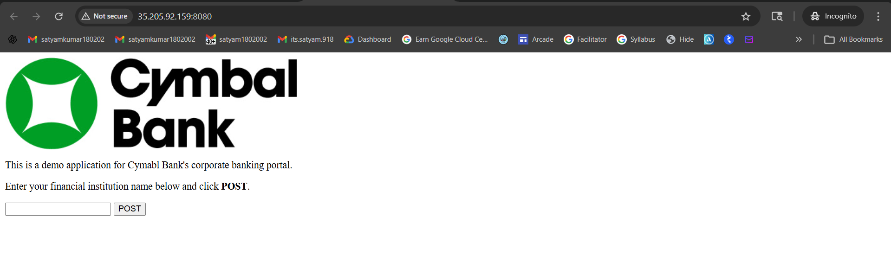
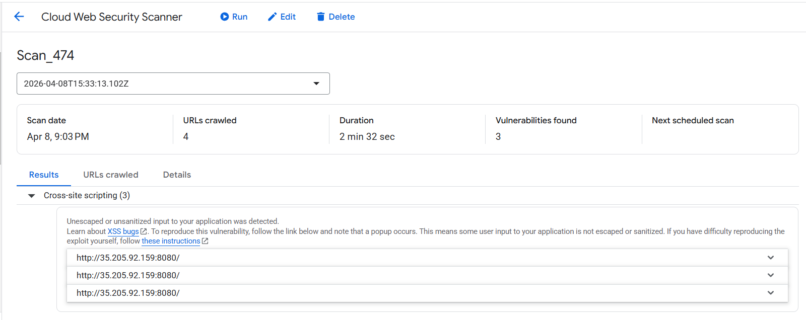
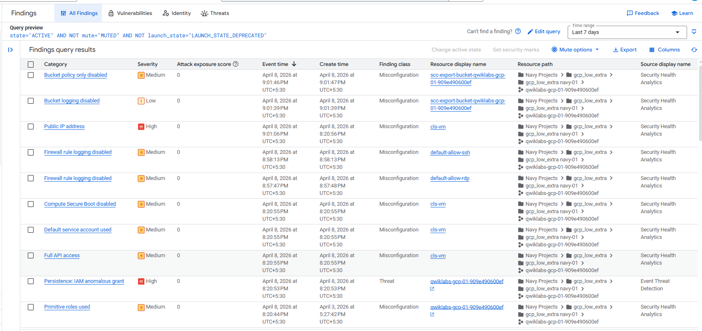
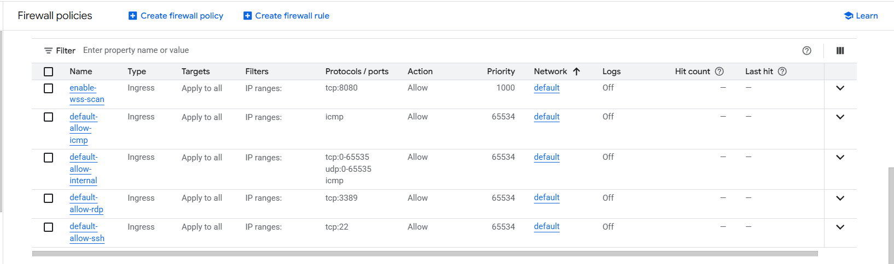
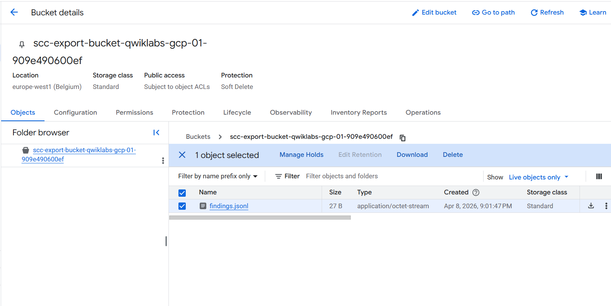

# 🏗️ Architecture Overview

## 📌 Overview

This project simulates a cloud environment where a vulnerable web application is deployed and monitored using Google Cloud security services.

The architecture is designed to demonstrate how security findings are generated, analyzed, and mitigated.

---

## ☁️ Components

### 🔹 1. Compute Engine (VM Instance)
- Hosts the Cymbal Bank web application  
- Publicly accessible via external IP  
- Acts as the primary attack surface  

---

### 🔹 2. Web Application (Cymbal Bank)
- Runs on port `8080`  
- Contains intentionally vulnerable endpoints  
- Used to simulate real-world web security issues (XSS, Clickjacking)  

📸  

---

### 🔹 3. Web Security Scanner
- Scans the application for vulnerabilities  
- Identifies issues such as:
  - Cross-Site Scripting (XSS)  
  - Clickjacking  

📸  

---

### 🔹 4. Security Command Center (SCC)
- Centralized security management service  
- Aggregates findings from multiple sources:
  - Security Health Analytics  
  - Web Security Scanner  
  - Event Threat Detection  

📸  

---

### 🔹 5. Firewall Rules (VPC Network)
- Controls inbound and outbound traffic  
- Initially misconfigured (open access)  
- Later hardened to restrict access  

📸  

---

### 🔹 6. Cloud Storage (GCS)
- Stores exported security findings  
- Used for audit and analysis  

📸  

---

## 🔄 Data Flow

1. User accesses the Cymbal Bank web application via public IP  
2. Web Security Scanner scans the application endpoints  
3. Vulnerabilities are detected and reported  
4. Security Command Center aggregates all findings  
5. Security issues are analyzed and mitigated  
6. Findings are exported to Cloud Storage for further analysis  

---

## ⚠️ Initial Security State

The environment starts in an insecure state:

- Public VM exposure  
- Open firewall rules  
- Disabled logging  
- Weak IAM configuration  

This allows security tools to generate realistic findings.

---

## 🛡️ Post-Mitigation State

After applying fixes:

- Firewall access is restricted  
- Unnecessary exposures are reduced  
- Findings are minimized or muted  
- Security posture is improved  

---

## 🧠 Key Insight

This architecture demonstrates how:

- Misconfigurations lead to real security risks  
- GCP security tools provide visibility  
- Proper controls reduce attack surface  

It reflects a practical cloud security monitoring and response workflow.
